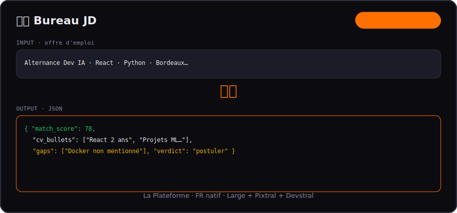
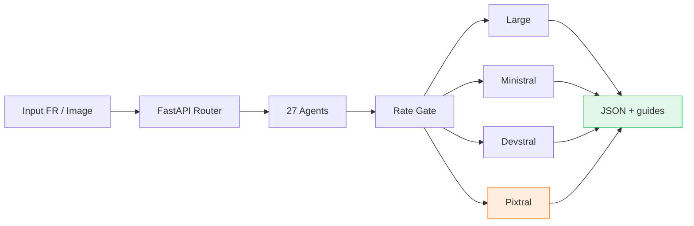

<div align="center">

# 🇫🇷 Mistral Bureau

**27 one-shot agents FR on [La Plateforme Mistral](https://docs.mistral.ai) — Large, Ministral, Devstral, Pixtral vision, zero-429.**

[](LICENSE)
[](#-agent-catalog)
[](backend/)
[](frontend/)
[](https://console.mistral.ai)
[](https://docs.mistral.ai/capabilities/vision)



*Le bureau pro français · 1 tâche · 1 appel · JSON structuré · Europe-ready.*

[Quick Start](#-quick-start) · [Example](#-example) · [Architecture](#-architecture) · [Ecosystem](#-mistral-ecosystem) · [Lab →](https://github.com/anthonyoccelli33480-ctrl/devstral-lab)

</div>

---

## 📋 Example

**Agent:** `Bureau JD` (Mistral Large)

**Input**
```
Alternance Développeur IA Full-Stack
React · Python · Bordeaux · 2026
Exigences : TypeScript, API REST, autonomie
```

**Output**
```json
{
  "match_score": 78,
  "cv_bullets": [
    "Mettre en avant projets React + FastAPI",
    "Citer expérience API REST / OpenAPI"
  ],
  "gaps": ["Docker non couvert dans le profil type"],
  "keywords_to_add": ["TypeScript", "autonomie", "Bordeaux"],
  "verdict": "postuler"
}
```

---

## 🎯 What is this?

**Mistral Bureau** is Phase 2 of the Mistral showcase — **French-first**, **multi-model**, including **Pixtral vision**.

| Model | Gate | Use case |
|-------|------|----------|
| **Mistral Large** (`mistral-large-2512`) | 30s | Produit, carrière, sécurité, éval |
| **Ministral 8B** (`ministral-8b-latest`) | 15s | TL;DR, intent router |
| **Devstral Small 2** (`devstral-small-latest`) | 30s | README, secrets, dev bridge |
| **Pixtral Large** (`pixtral-large-latest`) | 25s | Screenshots, OCR, UI audit |

> Phase 1 code → **[Devstral Lab](https://github.com/anthonyoccelli33480-ctrl/devstral-lab)**

## 📊 Benchmarks

| Metric | Mistral Bureau | ChatGPT generic |
|--------|----------------|-----------------|
| **Calls / task** | **1** | Multi-turn |
| **Output** | **JSON** | Markdown libre |
| **Modèle** | **Optimal par tâche** | Un seul modèle |
| **RGPD / FR** | **Agents dédiés** | Prompt ad-hoc |
| **429** | **Gates par modèle** | Rate limit opaque |

Reproduce: `./scripts/benchmark.sh` (backend `:8789`)

## 🌈 Mistral Spectrum

**Un input → 3 colonnes** (Ministral · Devstral · Large) avec recommandation du meilleur tier.

- File **séquentielle** anti-429 (~60–90s)
- Progression live dans l'UI (1/3 → 2/3 → 3/3)
- Idéal pour posts « quel modèle Mistral choisir ? »

Onglet **Bureau Spectrum** dans la sidebar.

## 🏗 Architecture



## 🚀 Quick Start

```bash
git clone https://github.com/anthonyoccelli33480-ctrl/mistral-bureau.git
cd mistral-bureau
cp .env.example .env   # MISTRAL_API_KEY

make install
make backend   # http://127.0.0.1:8789
make frontend  # http://127.0.0.1:5177
```

macOS: **`🇫🇷 Lancer Mistral Bureau.command`** on Desktop.

## 🤖 Agent Catalog

<details>
<summary><strong>Carrière (5)</strong></summary>

Bureau JD · Bureau STAR · Bureau LinkedIn · Bureau Email · Bureau README

</details>

<details>
<summary><strong>Produit (6)</strong></summary>

Bureau MVP · Decision · Pitch · Competitor · Pricing · Onboarding

</details>

<details>
<summary><strong>Contenu (3)</strong> · <strong>Sécurité (3)</strong></summary>

TL;DR · Compare · Outline · Threat · RGPD · Secret

</details>

<details>
<summary><strong>Vision Pixtral (6)</strong> — upload PNG/JPEG</summary>

UI Review · Diagram · OCR · A11y · Mockup · Wireframe

</details>

<details>
<summary><strong>IA (2)</strong> · <strong>Dev (2)</strong></summary>

Router · Eval · Review · Fix

</details>

→ [docs/AGENTS.md](docs/AGENTS.md)

## 🌐 Mistral Ecosystem

| Repo | Phase | Focus | Ports |
|------|-------|-------|-------|
| [devstral-lab](https://github.com/anthonyoccelli33480-ctrl/devstral-lab) | 1 | Code agentique | 8788 / 5175 |
| **mistral-bureau** | **2** | **FR + vision** | **8789 / 5177** |
| [flash-agents](https://github.com/anthonyoccelli33480-ctrl/flash-agents) | — | Cerebras speed | 8787 / 5173 |

## 🆚 Why Mistral Bureau?

| | Bureau | Devstral Lab | Flash Agents |
|--|--------|--------------|--------------|
| Language | **FR natif** | EN/code | EN |
| Models | **4 Mistral** | 2 code | 3 Cerebras |
| Vision | **Pixtral** | — | Gemma |
| Audience | **Europe / RH / RGPD** | Devs | Inference speed |

## 🤖 Machine-readable

- [`PROJECT.json`](PROJECT.json) — agents, Spectrum, API, ecosystem
- [`metadata.jsonld`](metadata.jsonld) — Schema.org (FR, Pixtral, Spectrum)

## 🔑 Keywords

`mistral-ai` · `pixtral` · `devstral` · `french-ai` · `rgpd` · `llm-agents` · `career` · `vision-llm` · `la-plateforme` · `structured-output`

## 📜 License

MIT

---

<div align="center">

**⭐ Vitrine Mistral complète — seduction La Plateforme en open source.**

</div>